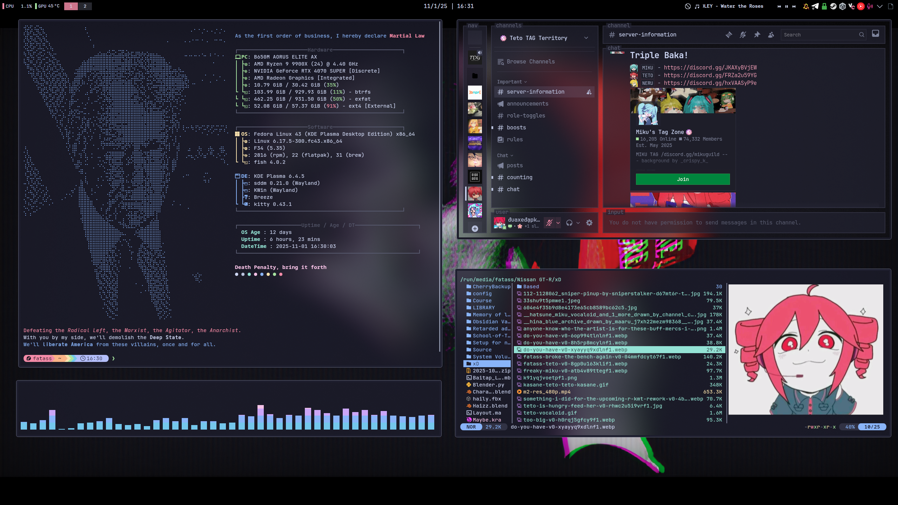

## The Catppuccin Republican with Mocha flavor.

## Everything I used
### Random Terminal Stuff
- [Btop](https://github.com/aristocratos/btop)
- [Cava](https://github.com/karlstav/cava)
- [Fastfetch](https://github.com/fastfetch-cli/fastfetch)
- [Fish](https://github.com/fish-shell/fish-shell)
- [Kitty](https://github.com/kovidgoyal/kitty)
- [Micro](https://micro-editor.github.io/)
- [Starship](https://starship.rs)
- [Yazi](https://github.com/sxyazi/**yazi**)
### Additional Stuff
- [Vesktop](https://github.com/Vencord/Vesktop) and [the themed I used.](https://github.com/refact0r/system24)
- [Andromeda SDDM](https://store.kde.org/p/2144475) 
## Installation
Make sure [git](https://git-scm.com/install/) and [stow](https://www.gnu.org/software/stow/) installed.
First, check out the dotfiles repo in your $HOME directory using git

`git clone git@github.com/Duaxedapkhuyettat/dotfiles.git
cd dotfiles`

then use GNU stow to create symlinks

`stow .`

